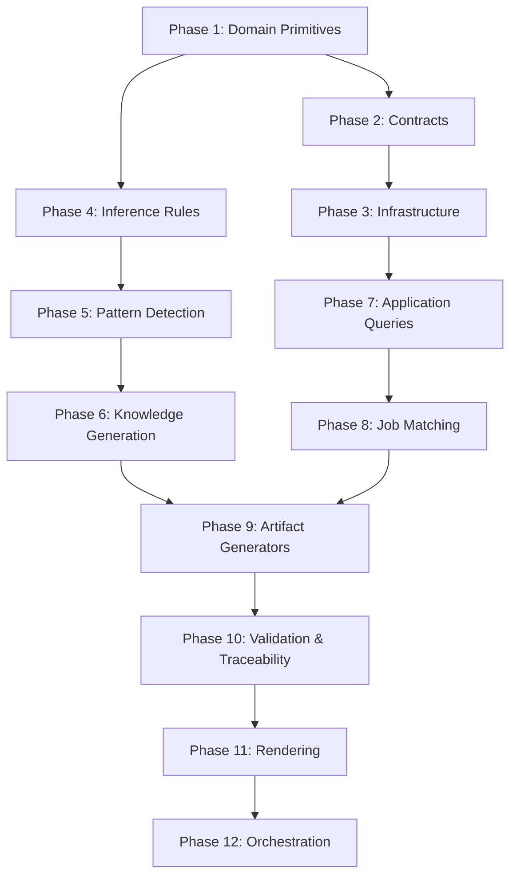

# Target State Architecture

## Vision

Transform the single-file MVP into a **modular monolith** with clear boundaries, explicit contracts, and testable components — while preserving the validated Evidence → Knowledge → Artifact flow.

**Not a microservices architecture.** Not a distributed system. A well-factored Python package with importable modules.

---

## Target Directory Structure

```
src/carrer/
├── __init__.py
├── domain/
│   ├── __init__.py
│   ├── models.py          # Evidence, Observation, Knowledge, Artifact (dataclasses)
│   ├── enums.py           # NodeType, EvidenceType, KnowledgeType, PrivacyLevel
│   ├── hashing.py         # stable_hash, identity utilities
│   └── timestamps.py      # now(), date formatting
├── application/
│   ├── __init__.py
│   ├── pipeline.py        # Orchestration: run_pipeline
│   ├── review.py          # Human review commands
│   └── queries.py         # Accepted artifact-safe knowledge, reviewable items
├── inference/
│   ├── __init__.py
│   ├── observations.py    # infer_observations (orchestrator)
│   ├── patterns/
│   │   ├── __init__.py
│   │   ├── technology.py  # TECHNOLOGY_USAGE_PATTERN
│   │   ├── domain.py      # DOMAIN_EXPERIENCE_PATTERN
│   │   ├── impact.py      # IMPACT_SIGNAL_PATTERN
│   │   ├── architecture.py # ARCHITECTURE_PATTERN
│   │   └── business.py    # BUSINESS_VALUE_PATTERN
│   ├── knowledge.py       # generate_knowledge, knowledge_from_observation
│   ├── rules.py           # Technology keywords, domain enrichment
│   └── enrichment.py      # enrich_domain, enrich_knowledge_statement
├── artifacts/
│   ├── __init__.py
│   ├── skill_matrix.py
│   ├── resume.py
│   ├── linkedin.py
│   ├── star_stories.py
│   ├── interview.py
│   ├── cover_letter.py
│   ├── timeline.py
│   ├── gap_analysis.py
│   ├── tailored/
│   │   ├── __init__.py
│   │   ├── resume.py
│   │   ├── cover_letter.py
│   │   ├── interview_prep.py
│   │   └── learning_roadmap.py
│   ├── rendering/
│   │   ├── __init__.py
│   │   ├── markdown.py    # All *_markdown functions
│   │   └── formatters.py  # artifact_date, artifact_topic, claim_strength
│   ├── validation.py      # validate_artifact, warnings
│   └── traceability.py    # artifact_traceability, evidence_summary
├── ports/
│   ├── __init__.py
│   ├── storage.py         # AbstractGraphStore protocol
│   └── source.py          # source_export_v1 schema (TypedDict)
├── infrastructure/
│   ├── __init__.py
│   ├── graph_store.py     # GraphStore implementation
│   ├── ingestion.py       # ingest_fixture, evidence_type_for
│   ├── normalization.py   # validate/normalize source_export_v1
│   └── job_matching.py    # Job requirement matching utilities
└── interfaces/
    ├── __init__.py
    ├── cli.py             # Command-line interface (future)
    └── api.py             # HTTP API (future)
```

---

## Layer Responsibilities

### Domain Layer

**Purpose:** Pure domain logic, no I/O, no framework dependencies.

**Exports:**
- `EvidenceNode`, `ObservationNode`, `KnowledgeNode`, `ProfessionalArtifact` (dataclasses)
- `NodeType`, `EvidenceType`, `KnowledgeType`, `PrivacyLevel` (enums)
- `stable_hash(value) -> str`
- `now() -> str`
- `most_restrictive(levels) -> str`

**Rules:**
- No imports from application, inference, artifacts, infrastructure
- Only stdlib dependencies
- Immutable dataclasses

**Validation:**
- Runs independently
- Zero side effects
- Pure functions only

---

### Application Layer

**Purpose:** Orchestration, queries, human review commands.

**Exports:**
- `run_pipeline(fixture_path, store_path) -> tuple[GraphStore, dict]`
- `review_node(store, node_id, decision, reason, actor) -> dict`
- `review_items(store, decision, node_type, reason, actor) -> list[dict]`
- `reviewable_items(store, status, node_type) -> list[dict]`
- `set_knowledge_privacy(store, node_id, privacy_level, reason, actor) -> dict`
- `accepted_artifact_safe_knowledge(store) -> list[dict]`

**Dependencies:**
- domain (models, enums)
- ports (AbstractGraphStore)
- inference (infer_observations, generate_knowledge)
- artifacts (generate_* functions)
- infrastructure (graph_store for concrete implementation)

**Rules:**
- Coordinates across layers
- Does not implement business logic
- Thin orchestration only

---

### Inference Layer

**Purpose:** Pattern detection, observation creation, knowledge generation.

**Exports:**
- `infer_observations(store) -> list[dict]` (orchestrator)
- `generate_knowledge(store) -> list[dict]`
- `knowledge_from_observation(props) -> tuple[str, str]`
- `enrich_domain(raw_domain) -> str`
- `enrich_knowledge_statement(type, statement, evidence, store) -> str`
- Pattern detectors (technology, domain, impact, architecture, business)

**Dependencies:**
- domain (models, enums, hashing)
- ports (AbstractGraphStore)

**Rules:**
- Read-only on evidence
- Creates observations and knowledge
- No artifact generation
- Deterministic (no LLM)

**Extensibility:**
- New pattern detectors added in `inference/patterns/`
- Rules extracted to configuration (future)

---

### Artifacts Layer

**Purpose:** Generate professional artifacts from accepted knowledge.

**Exports:**
- `generate_skill_matrix(store) -> dict`
- `generate_resume_draft(store) -> dict`
- `generate_linkedin_draft(store) -> dict`
- `generate_star_stories_draft(store) -> dict`
- `generate_interview_answers_draft(store) -> dict`
- `generate_cover_letter_draft(store, role) -> dict`
- `generate_career_timeline_draft(store) -> dict`
- `generate_gap_analysis_draft(store, role) -> dict`
- `generate_tailored_resume(store, job_id) -> dict`
- `generate_tailored_cover_letter(store, job_id, company) -> dict`
- `generate_interview_prep_guide(store, job_id) -> dict`
- `generate_learning_roadmap(store, job_id) -> dict`
- `validate_artifact(artifact, store) -> list[dict]`
- `artifact_traceability(artifact, store) -> list[dict]`
- Markdown renderers for all artifact types

**Dependencies:**
- domain (models, enums)
- ports (AbstractGraphStore)
- application (accepted_artifact_safe_knowledge)
- inference (enrichment)
- infrastructure (job_matching)

**Rules:**
- Read-only on knowledge
- Creates artifact nodes
- Validates before export
- Provides traceability

**Extensibility:**
- New generators added as modules in `artifacts/`
- New renderers added in `artifacts/rendering/`

---

### Ports Layer

**Purpose:** Contracts and interfaces for external dependencies.

**Exports:**
- `AbstractGraphStore` (Protocol) — Storage interface
- `source_export_v1` (TypedDict) — Import schema

**Dependencies:**
- domain (models, enums)

**Rules:**
- No implementations
- Only type definitions and protocols
- Framework-agnostic

---

### Infrastructure Layer

**Purpose:** Concrete implementations of ports, external integrations.

**Exports:**
- `GraphStore` (implements AbstractGraphStore)
- `ingest_fixture(fixture, store) -> dict`
- `validate_source_export_v1(export) -> None`
- `normalize_source_export(export) -> dict`
- `normalize_source_payload(entity_type, payload) -> dict`
- `infer_technologies_from_payload(payload) -> list[str]`
- `infer_business_domain_from_payload(payload) -> str | None`
- `job_description_requirements(store) -> list[dict]`
- `job_requirement_matches(store) -> tuple[list, list]`
- Job matching utilities

**Dependencies:**
- domain (models, enums, hashing)
- ports (AbstractGraphStore, source_export_v1)
- inference (rules for validation)

**Rules:**
- Only layer with I/O
- Implements persistence
- Validates and normalizes input
- No business logic

**Extensibility:**
- Alternative storage backends implement AbstractGraphStore
- New source formats added in normalization

---

### Interfaces Layer

**Purpose:** External entry points (CLI, API, future).

**Exports:**
- `cli` module (future) — Command-line interface
- `api` module (future) — HTTP API

**Dependencies:**
- application (run_pipeline, review commands, queries)
- artifacts (renderers)

**Rules:**
- Thin wrappers
- No business logic
- Framework-specific (Click, FastAPI, etc.)

---

## Dependency Direction

```
domain          ← (no dependencies)
  ↑
ports           ← domain
  ↑
inference       ← domain, ports
  ↑
application     ← domain, ports, inference
  ↑
artifacts       ← domain, ports, application, inference, infrastructure
  ↑
infrastructure  ← domain, ports, inference
  ↑
interfaces      ← application, artifacts
```

**Key Rule:** Dependencies only flow upward. Domain is dependency-free.

---

## Contracts Between Layers

### Application → Infrastructure

```python
from ports import AbstractGraphStore
from infrastructure import GraphStore

store: AbstractGraphStore = GraphStore.load(path)
```

Application depends on **protocol**, infrastructure provides **implementation**.

---

### Inference → Ports

```python
from ports import AbstractGraphStore

def infer_observations(store: AbstractGraphStore) -> list[dict]:
    evidence = store.nodes_by_type("EvidenceNode")
    ...
```

Inference depends on **storage protocol**, not concrete implementation.

---

### Artifacts → Application

```python
from application import accepted_artifact_safe_knowledge

def generate_resume_draft(store: AbstractGraphStore) -> dict:
    knowledge = accepted_artifact_safe_knowledge(store)
    ...
```

Artifacts depend on **query functions**, not direct store access.

---

### Infrastructure → Domain

```python
from domain import stable_hash, now

evidence_id = "evidence:" + stable_hash([source_id, record_type, external_id, ...])
created_at = now()
```

Infrastructure uses **domain utilities** for hashing and timestamps.

---

## Deterministic Core vs Probabilistic Enrichment

### Deterministic (MVP)

- Evidence ingestion
- Observation inference (rule-based)
- Knowledge generation (rule-based)
- Artifact generation (template-based)
- Validation (regex-based)

**Location:** All current code

---

### Probabilistic (Future)

- LLM-based enrichment (optional)
- Observation rephrasing
- Impact signal extraction
- Natural language generation

**Location:** `inference/llm/` (future), `artifacts/llm/` (future)

**Rules:**
- Must be versioned
- Must be regenerable
- Must trace to deterministic core
- Must be optional (system works without LLM)

---

## Preserved Architecture

### Evidence First

- Evidence remains immutable
- Evidence graph is single source of truth
- All knowledge traces to evidence

**Implementation:** Enforced by `GraphStore.update_node()`

---

### Human in the Loop

- All observations proposed before accepted
- All knowledge proposed before accepted
- Privacy levels human-controlled
- Artifact export requires human review

**Implementation:** `application/review.py`

---

### Privacy First

- Privacy levels on evidence, observations, knowledge
- Automatic filtering in queries
- Validation checks for privacy leaks

**Implementation:** `most_restrictive()`, `accepted_artifact_safe_knowledge()`

---

### Full Traceability

- Artifacts → Knowledge → Observations → Evidence
- Traceability reports included

**Implementation:** `artifacts/traceability.py`

---

## Incremental Extraction Strategy

### Phase 1: Foundation (Priority 1)

**Extract domain primitives** — no business logic.

**Modules:**
1. `domain/enums.py` — Extract constants to enums
2. `domain/hashing.py` — Extract stable_hash, now, most_restrictive
3. `domain/timestamps.py` — Date formatting utilities

**Risk:** Low (no business logic)

**Tests:** Copy existing tests, verify behavior unchanged

**Order:** Enums → Hashing → Timestamps (hashing depends on enums)

---

### Phase 2: Contracts (Priority 2)

**Define interfaces** — no implementations yet.

**Modules:**
1. `ports/storage.py` — Define AbstractGraphStore protocol
2. `ports/source.py` — Define source_export_v1 TypedDict
3. `domain/models.py` — Define Evidence, Observation, Knowledge, Artifact dataclasses (optional, can defer)

**Risk:** Low (no behavior change)

**Tests:** Type check only

**Order:** Storage protocol → Source schema → Models (models depend on enums)

---

### Phase 3: Infrastructure (Priority 3)

**Extract storage and ingestion** — single responsibility.

**Modules:**
1. `infrastructure/graph_store.py` — Extract GraphStore class
2. `infrastructure/normalization.py` — Extract validation and normalization
3. `infrastructure/ingestion.py` — Extract ingest_fixture and helpers

**Risk:** Medium (storage is critical path)

**Tests:** Comprehensive integration tests for GraphStore

**Order:** GraphStore → Normalization → Ingestion (ingestion depends on both)

---

### Phase 4: Inference Rules (Priority 4)

**Extract inference configuration** — separate data from logic.

**Modules:**
1. `inference/rules.py` — Extract TECHNOLOGY_KEYWORDS, DOMAIN_ENRICHMENT, thresholds
2. `inference/enrichment.py` — Extract enrich_domain, enrich_knowledge_statement, extract_context_signals

**Risk:** Low (pure functions)

**Tests:** Unit tests for enrichment

**Order:** Rules → Enrichment (enrichment depends on rules)

---

### Phase 5: Pattern Detection (Priority 5)

**Extract inference patterns** — one detector per module.

**Modules:**
1. `inference/patterns/technology.py` — TECHNOLOGY_USAGE_PATTERN
2. `inference/patterns/domain.py` — DOMAIN_EXPERIENCE_PATTERN
3. `inference/patterns/impact.py` — IMPACT_SIGNAL_PATTERN
4. `inference/patterns/architecture.py` — ARCHITECTURE_PATTERN
5. `inference/patterns/business.py` — BUSINESS_VALUE_PATTERN
6. `inference/observations.py` — Orchestrator (infer_observations)

**Risk:** Medium (complex business logic)

**Tests:** Unit tests per detector

**Order:** Technology → Domain → Impact → Architecture → Business → Orchestrator

---

### Phase 6: Knowledge Generation (Priority 6)

**Extract knowledge generation** — separate from inference.

**Modules:**
1. `inference/knowledge.py` — Extract generate_knowledge, knowledge_from_observation

**Risk:** Medium (critical for artifacts)

**Tests:** Integration tests for knowledge generation

**Order:** After Phase 5 (depends on observations)

---

### Phase 7: Application Queries (Priority 7)

**Extract orchestration and queries** — thin layer.

**Modules:**
1. `application/queries.py` — Extract accepted_artifact_safe_knowledge, reviewable_items
2. `application/review.py` — Extract review_node, review_items, set_knowledge_privacy

**Risk:** Low (thin wrappers)

**Tests:** Integration tests for review workflow

**Order:** Queries → Review (review depends on queries)

---

### Phase 8: Job Matching (Priority 8)

**Extract job description utilities** — support for tailored artifacts.

**Modules:**
1. `infrastructure/job_matching.py` — Extract all job requirement matching functions

**Risk:** Low (self-contained)

**Tests:** Unit tests for matching logic

**Order:** After Phase 3 (depends on graph store)

---

### Phase 9: Artifact Generators (Priority 9)

**Extract generators** — one per artifact type.

**Modules:**
1. `artifacts/skill_matrix.py`
2. `artifacts/resume.py`
3. `artifacts/linkedin.py`
4. `artifacts/star_stories.py`
5. `artifacts/interview.py`
6. `artifacts/cover_letter.py`
7. `artifacts/timeline.py`
8. `artifacts/gap_analysis.py`
9. `artifacts/tailored/resume.py`
10. `artifacts/tailored/cover_letter.py`
11. `artifacts/tailored/interview_prep.py`
12. `artifacts/tailored/learning_roadmap.py`

**Risk:** Low (generators are independent)

**Tests:** Integration tests per generator

**Order:** Generic → Tailored (tailored depends on generic + job matching)

---

### Phase 10: Validation & Traceability (Priority 10)

**Extract validation and traceability** — support for artifacts.

**Modules:**
1. `artifacts/validation.py` — Extract validate_artifact, warnings
2. `artifacts/traceability.py` — Extract artifact_traceability, evidence_summary

**Risk:** Low (pure functions)

**Tests:** Unit tests for validation rules

**Order:** After Phase 9 (depends on artifact structure)

---

### Phase 11: Rendering (Priority 11)

**Extract renderers** — separate formatting from generation.

**Modules:**
1. `artifacts/rendering/formatters.py` — Extract artifact_date, artifact_topic, claim_strength
2. `artifacts/rendering/markdown.py` — Extract all *_markdown functions

**Risk:** Low (pure formatting)

**Tests:** Snapshot tests for rendering

**Order:** After Phase 9 (depends on artifact structure)

---

### Phase 12: Orchestration (Priority 12)

**Extract pipeline** — top-level orchestration.

**Modules:**
1. `application/pipeline.py` — Extract run_pipeline

**Risk:** Low (thin wrapper)

**Tests:** End-to-end integration test

**Order:** Last (depends on all other phases)

---

## Extraction Dependencies



---

## Testing Strategy

### Unit Tests

- **Scope:** Single module, mocked dependencies
- **Target:** Domain, inference patterns, validation, rendering
- **Coverage:** 80%+

### Integration Tests

- **Scope:** Multiple modules, real dependencies
- **Target:** Application queries, artifact generators, pipeline
- **Coverage:** Critical paths only

### Characterization Tests

- **Scope:** Full system, real fixtures
- **Target:** End-to-end behavior preservation
- **Coverage:** Existing test_baseline_characterization.py

### Snapshot Tests

- **Scope:** Output formats
- **Target:** Markdown renderers
- **Coverage:** All artifact types

---

## Backward Compatibility

### Import Path

**Old:**
```python
from career_intelligence_mvp import GraphStore, ingest_fixture, generate_resume_draft
```

**New:**
```python
from carrer.infrastructure import GraphStore
from carrer.infrastructure import ingest_fixture
from carrer.artifacts import generate_resume_draft
```

**Transition:** Keep `career_intelligence_mvp.py` as compatibility shim that re-exports from modules.

---

### Data Format

**GraphStore JSON format remains unchanged:**
- Same node structure
- Same edge structure
- Same audit records

**Migration:** None required (format is stable)

---

### Behavior

**All existing tests must pass after each extraction:**
- Same inputs → Same outputs
- Same validation warnings
- Same traceability
- Same artifact content

---

## Risks & Mitigations

### Risk 1: Import Cycles

**Symptom:** Module A imports B, B imports A

**Mitigation:**
- Strict dependency direction enforcement
- Ports layer for interfaces
- Circular imports prohibited by design

**Detection:** `import-linter` in CI

---

### Risk 2: Performance Regression

**Symptom:** Slower imports, slower execution

**Mitigation:**
- Lazy imports where applicable
- Benchmark tests before/after
- Profile critical paths

**Detection:** Performance tests in CI

---

### Risk 3: Behavior Divergence

**Symptom:** Tests fail after extraction

**Mitigation:**
- Small extraction steps
- Run full test suite after each extraction
- Characterization tests as baseline

**Detection:** CI fails if tests fail

---

### Risk 4: Over-Abstraction

**Symptom:** Complex protocols, excessive indirection

**Mitigation:**
- Extract only when duplication or testing demands it
- Keep simple things simple
- Defer dataclasses to Phase 2+ if not needed

**Detection:** Code review

---

## Success Criteria

### After Full Extraction

1. ✅ All tests pass
2. ✅ Same inputs → Same outputs (characterization tests)
3. ✅ No import cycles
4. ✅ Each module <500 lines
5. ✅ GraphStore JSON format unchanged
6. ✅ Performance within 10% of baseline
7. ✅ Imports <1 second
8. ✅ Clear module responsibilities
9. ✅ Documented contracts between layers
10. ✅ Backward-compatible shim layer

---

## Next Step After Extraction

**Not part of this prompt, but noted for continuity:**

1. Extract collectors to `carrer.collectors` (Azure DevOps, GitLab)
2. Add CLI commands to `carrer.interfaces.cli`
3. Implement versioned knowledge regeneration
4. Add LLM-based enrichment (optional)
5. Implement incremental ingestion
6. Add configuration management
7. Implement alternative storage backends (SQLite, PostgreSQL)
8. Add structured export formats (JSON, PDF)
9. Implement internationalization
10. Add user-extensible inference rules

---

## Conclusion

The target architecture is a **modular monolith** with:
- **Clear boundaries** between domain, application, inference, artifacts, infrastructure
- **Explicit contracts** via ports and protocols
- **Preserved flow** (Evidence → Knowledge → Artifact)
- **Incremental extraction** (12 phases, dependency-aware)
- **Zero behavior change** (characterization tests enforce)
- **Backward compatibility** (shim layer for old imports)

The extraction is designed to be **safe, incremental, and testable** at every step.
